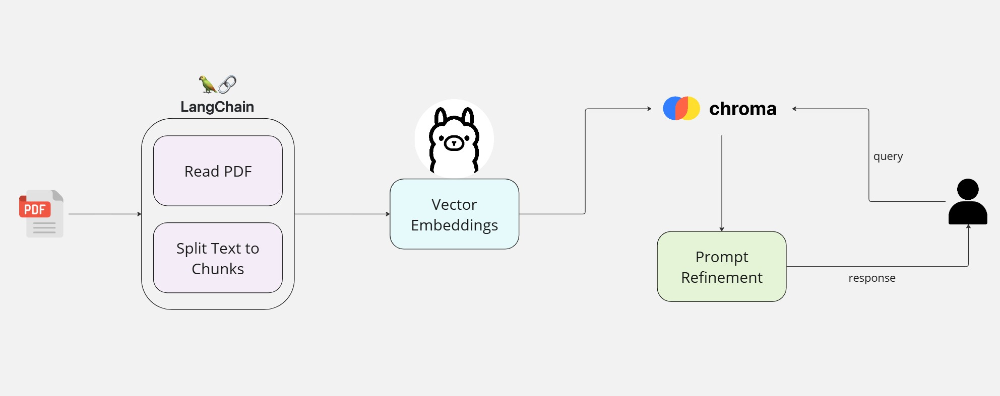

# Chat with PDFs using Local LLM 
Chat with PDFs using local Ollama Models and Langchain to keep documents secure and on-premises 

### Basic Flow of the Usecase



### Installing Ollama

* Download Ollama from [Ollama's website](https://ollama.com/)

* Pull the required models
```
        ollama pull mistral
        ollama pull nomic-embed-text
```

* To view the list of models available <br/>
```
        ollama list
```

* Add Ollama Models path to the Environment Variables

### Run the Jupyter Notebook

* Install all the libraries from the requirements.txt file
* Run the Jupyter Notebook titled 'local_pdf_reader.ipynb'
